# Table of Contents
1. [Creating a Note](#creating-a-note)
2. [Writing a Note](#writing-a-note)
3. [Summarizing Notes](#summarizing-notes)
4. [Explaining Selected Text](#explaining-selected-text)
5. [Generating Flashcards](#generating-flashcards)
6. [Settings Page](#settings-page)

# Creating a Note

## Create File Button
There are couple of ways that a note can be created. The first option is to use the `add file` button at top of the explorer tree as shown beow.

After pressing the button, you will be prompted to enter a name for the new file, and by pressing `Enter`, the file will be created at the root directory of your vault, as shown below.

## Directory Context Options
You can also create a file by using the `create file` context option by right clicking on any directory.

This will create a note with a default name `Untitled`, which you can change by right clicking and picking the `Rename` option.

## Main Page Option
If there are no notes open, you can create a file by clicking the `create new file` option in the welcome screen, as shown below.

This will prompt you to choose a name for your directory, and after submitting, the file will be created in the root directory.

# Writing a Note

After clicking on a note, you will be presented with the text editor on the right side of the screen.
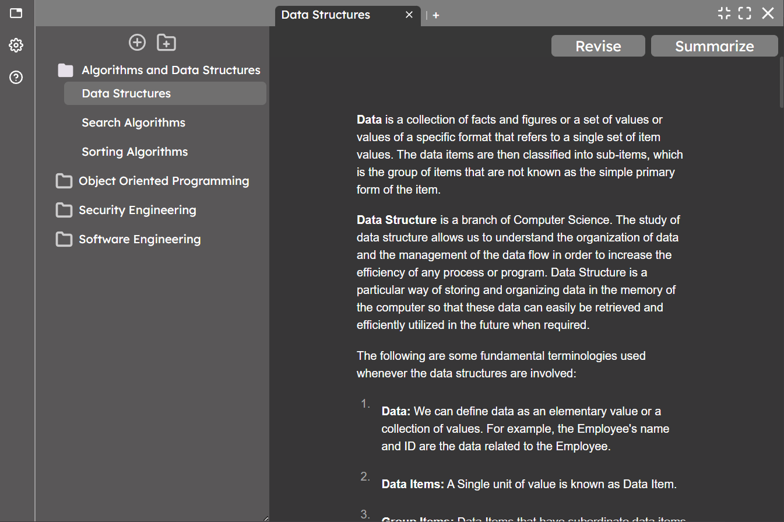

There are 2 ways you can use advanced notation with Cognitum. The first one is to use your knowledge of markdown notation, which can also be learned [here](https://www.markdownguide.org/basic-syntax/).

Otherwise, you can use the "+" icon near the text field to access various options for notation.
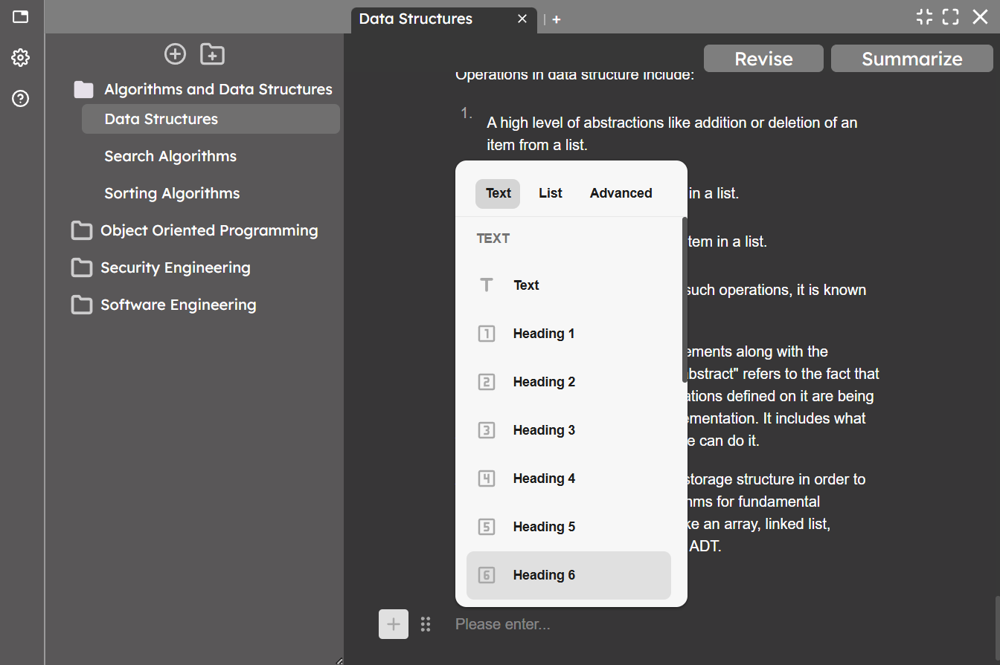

This list allows adding headings, math formulas, code block, images, and much more.

# Summarizing Notes

A summary for a note can be generated using the summarize button on top of the text editor.
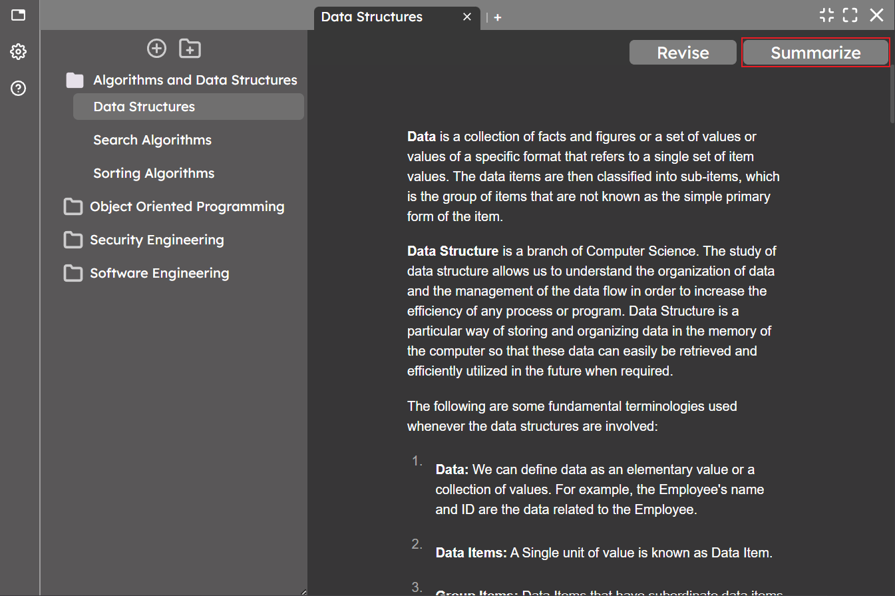

If the note does not have enough content, you will see a message saying "Nothing to summarize", which is fair.
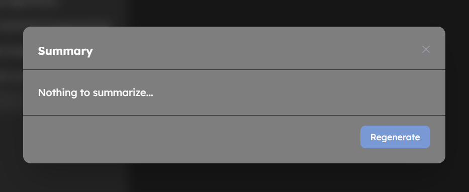

However, if the note has enough content, you will see a message that the summary is being generated.
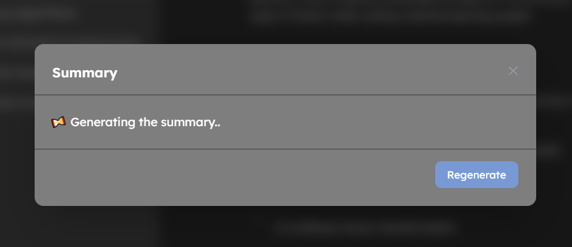

After the summary has been generated, it will be shown, slowly appearing on screen with a typewriter effect. You can also request a new summary by pressing the `Regenerate` button.
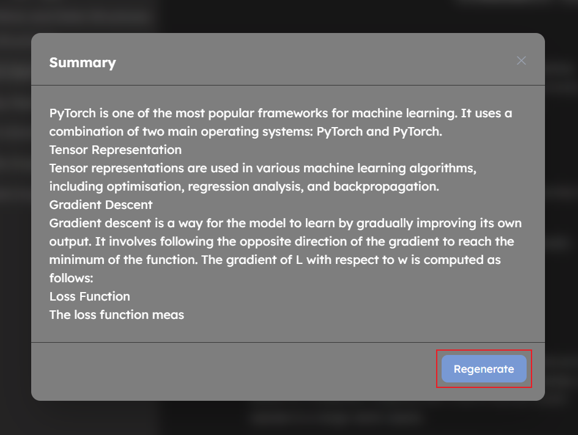

# Explaining Selected Text

When you highlight a certain piece of text by selecting it, you will be shown multiple options, and one of them will be the `Explain` option.
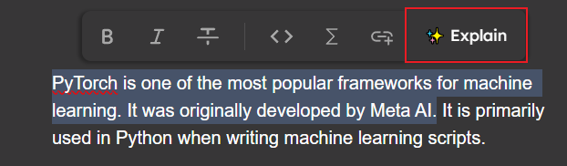

By clicking it, you can prompt the generation of an explanation for the selected text. When you hover over the highlight, you can preview it.
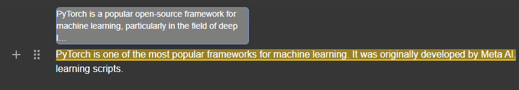

And by clicking on it, you can open the full explanation. Here you can see the explanation, and options such as generate new explanation, and delete explanation.
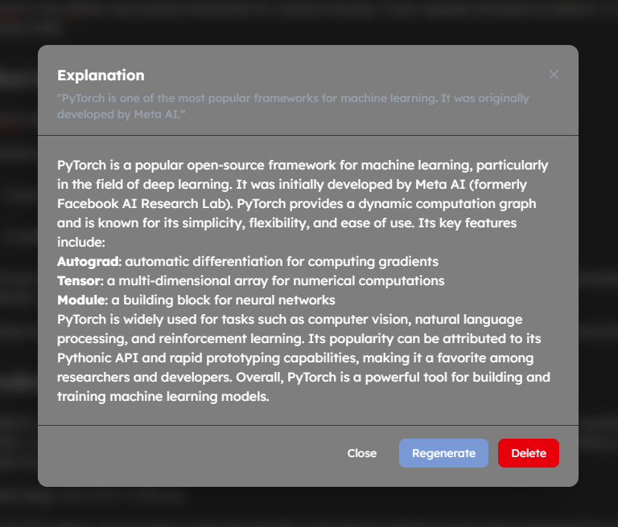

# Generating Flashcards

Flashcards can be accessed using the `Revise` button above the text editor.
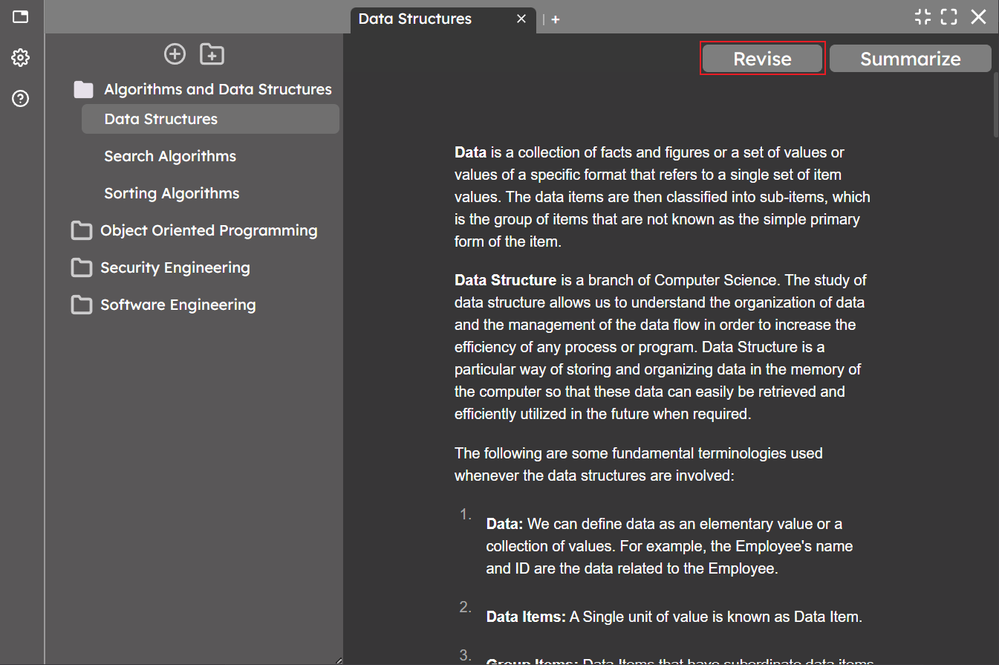

If there is no content in the note, you will be told that the revision for the note is done (quite literally).
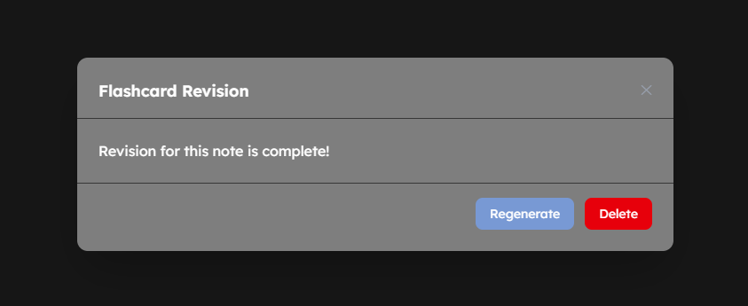

However, if there is content, you will see a message saying that the flashcards are being generated.
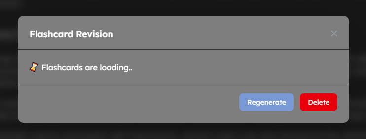

After the loading is complete, you will see the first question. You have the options to regenerate the current flashcard, delete it, or reveal the answer.
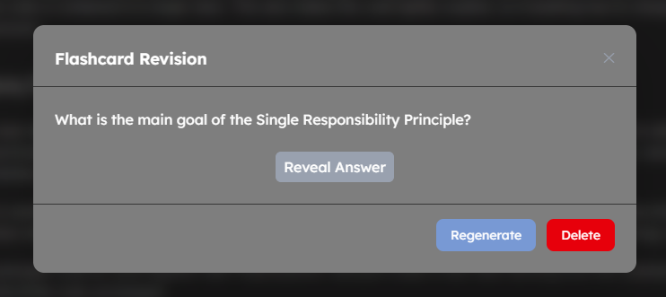

When you reveal the answer, you will also see 5 options, that allow you to assess how well you were able to recall the given flashcard. The next review date for that flashcard will be scheduled based on the answer you give.
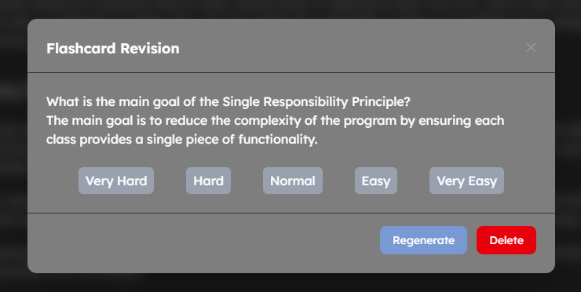

# Settings Page

When you press on the settings icon, you will be presented with the settings page.
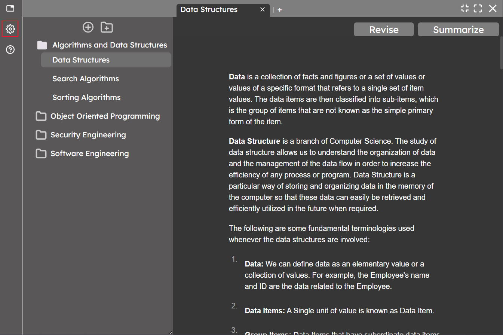

In this page, you can see your account information, your vault location, and the synchronisation status.
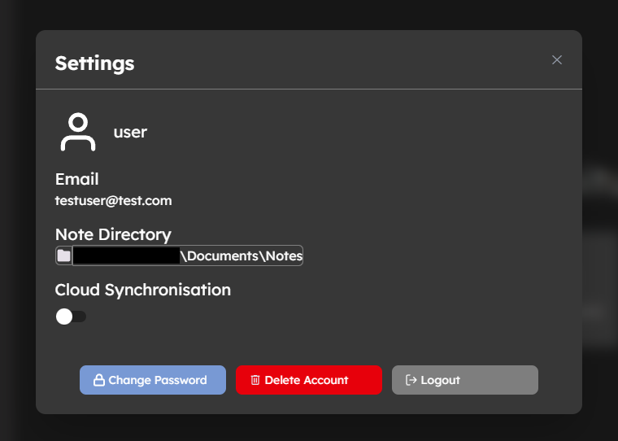

If you wish to change your password, you will be prompted to enter a new password and repeat it for confirmation.
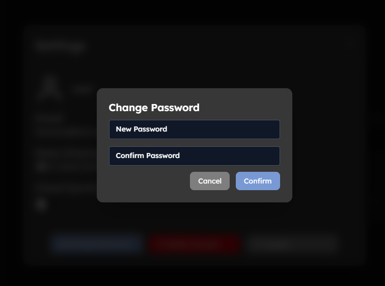

After confirming, a code will be sent to your email for confirmation, and once you submit, your password will be changed successfully. You can also press `Back` to return to main page if you changed your mind.
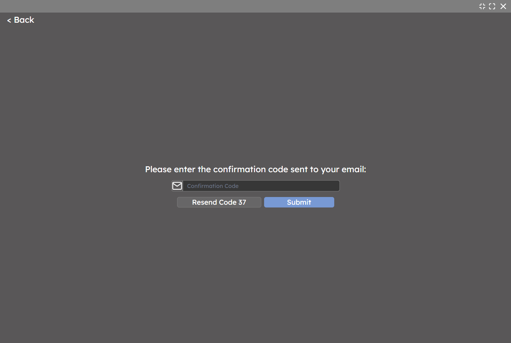

If you decide to delete your account,  you will be prompted to confirm the action. Doing this will lead to all of your information being wiped both locally and from the server. Do this at your own caution. After the deletion, you will be prompted to the home screen.
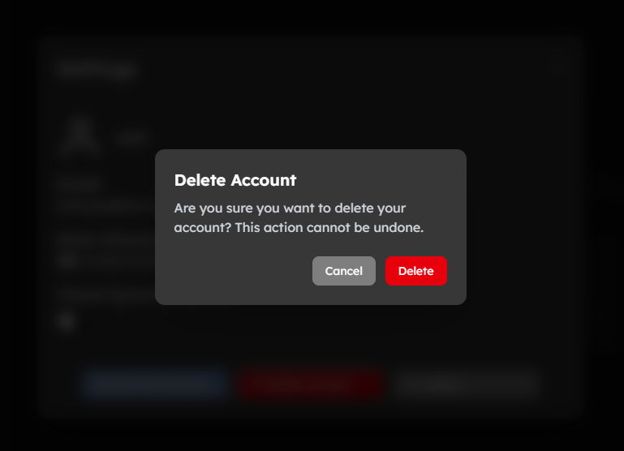

The logout button also leads you to the home screen, but without deleting your data. The synchronisation button will turn on cloud sync, which will automatically save all of your data to the cloud, and also fetch any existing data to your local device.

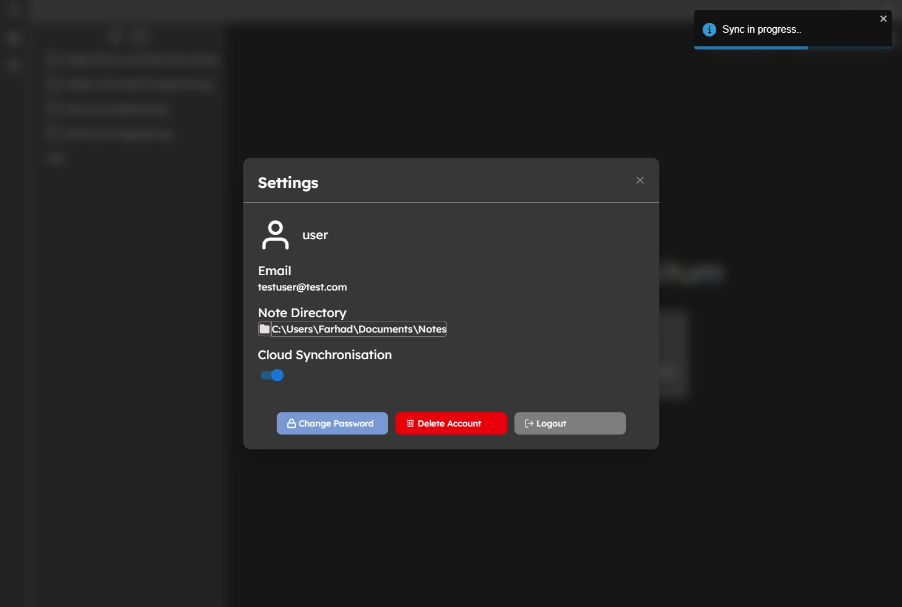

That's all the functionality provided by Cognitum. Good luck with your studies!