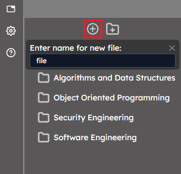
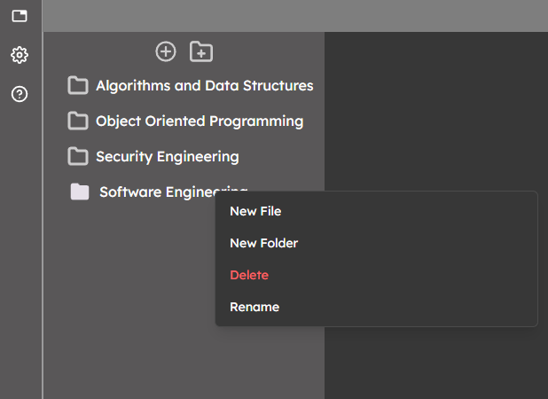
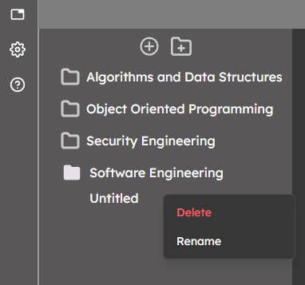
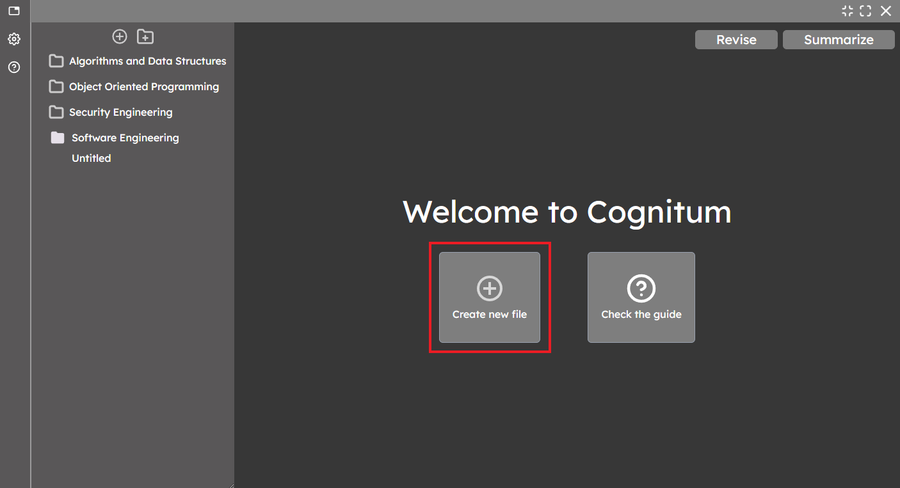
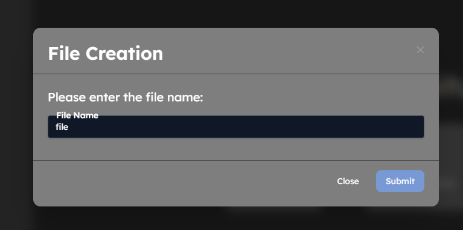

# Table of Contents
1. [Creating a Note](#creating-a-note)

# Creating a Note

## Create File Button
There are couple of ways that a note can be created. The first option is to use the `add file` button at top of the explorer tree as shown beow.

After pressing the button, you will be prompted to enter a name for the new file, and by pressing `Enter`, the file will be created at the root directory of your vault, as shown below.

## Directory Context Options
You can also create a file by using the `create file` context option by right clicking on any directory.

This will create a note with a default name `Untitled`, which you can change by right clicking and picking the `Rename` option.

## Main Page Option
If there are no notes open, you can create a file by clicking the `create new file` option in the welcome screen, as shown below.

This will prompt you to choose a name for your directory, and after submitting, the file will be created in the root directory.

